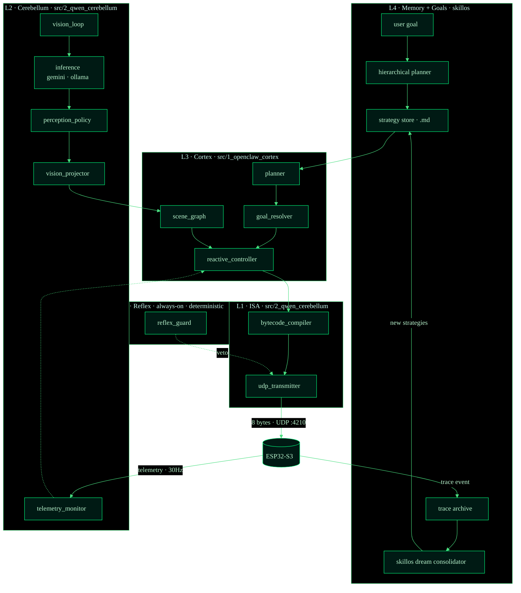
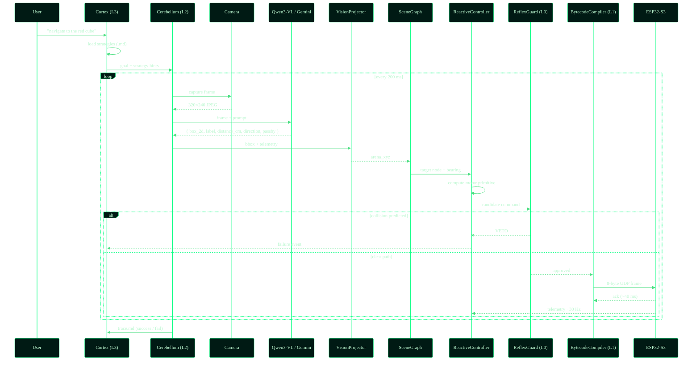
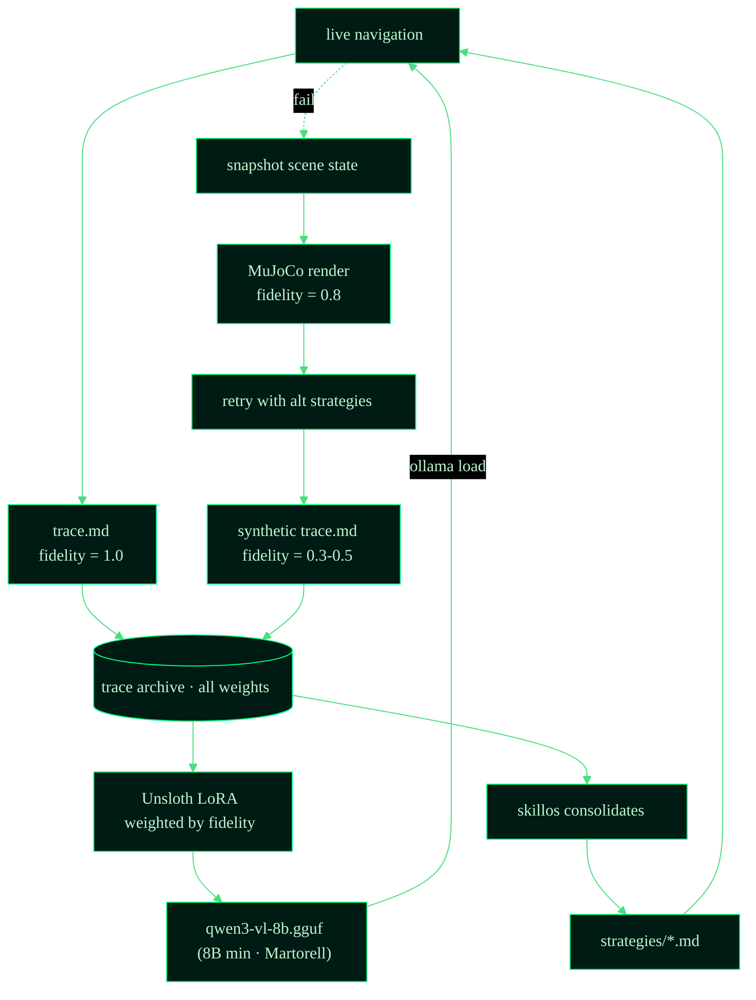
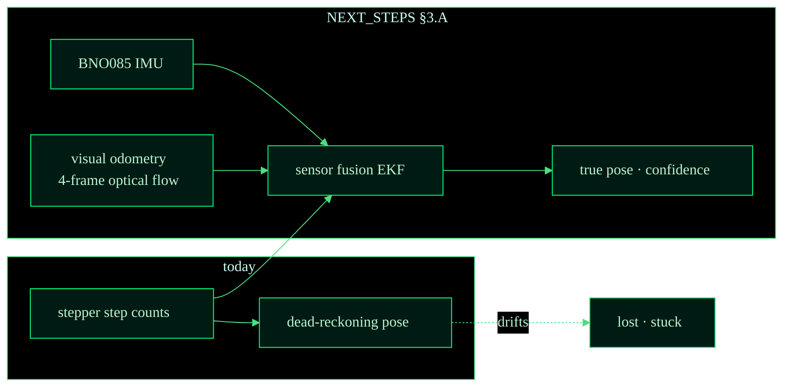
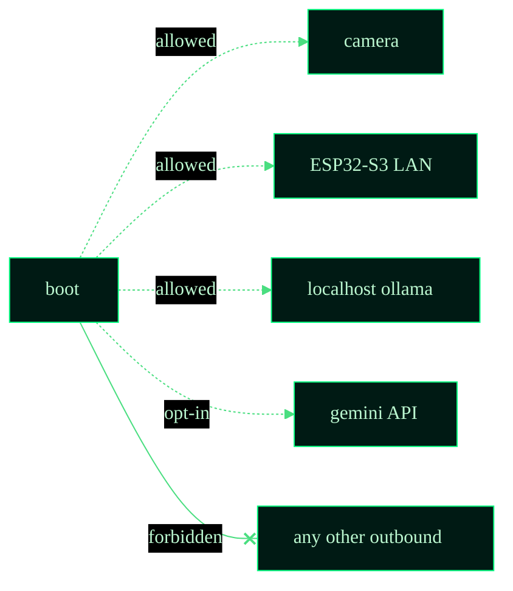

# Architecture

> Companion to [`README.md`](../README.md). The README is the *pitch*
> (what RoClaw is and how to run it). This doc is the *map* — every
> layer, every data path, every safety invariant.

---

## System overview

RoClaw is one of three repos that together form an embodied-AI stack:

```mermaid
%%{init: {'theme':'base', 'themeVariables': {'primaryColor':'#001a14','primaryTextColor':'#bbf7d0','primaryBorderColor':'#00ff7f','lineColor':'#4ade80','secondaryColor':'#001a24','tertiaryColor':'#000','background':'#000','mainBkg':'#001a14','clusterBkg':'#000','clusterBorder':'#4ade80','edgeLabelBackground':'#000','fontFamily':'ui-monospace, SF Mono, Menlo, Consolas, monospace'}}}%%
flowchart LR
    subgraph User["💬 User"]
        WA[WhatsApp / Voice / CLI]
    end
    subgraph Cortex["🧠 skillos · prefrontal cortex"]
        Plan[hierarchical planner]
        Strat[strategy retrieval]
        Dream[dream consolidation]
    end
    subgraph Cereb["⚡ RoClaw · cerebellum (this repo)"]
        Vis[vision perception]
        SG[scene graph]
        RC[reactive controller]
        BC[bytecode compiler]
        RG[reflex guard · L0]
    end
    subgraph Brain["🦾 ESP32-S3 · brain stem"]
        FW[firmware]
        Mot[stepper motors]
        Tel[telemetry · IMU]
    end

    WA -->|"goal"| Plan
    Plan -->|"plan + strategies"| Vis
    Strat -->|"context"| Plan
    Dream -->|"consolidates"| Strat
    Vis --> SG
    SG --> RC
    RC --> BC
    BC -->|"UDP :4210 · 8B ISA v2"| FW
    RG -.->|"veto"| BC
    FW --> Mot
    Mot --> Tel
    Tel -.->|"pose · bearing · distance"| RC
    Tel -.->|"telemetry"| Plan
```



The dotted lines are **feedback paths**. Telemetry from the robot
re-enters the cerebellum (closed-loop control) and the cortex (memory
formation). The reflex guard at L0 has direct authority to veto motor
commands before they reach the bytecode compiler.


## The 5-tier stack



### tier responsibilities

| Tier | Latency budget | Determinism | Purpose |
|---|---|---|---|
| **L4 · skillos memory** | minutes / overnight | none — LLM | learn · dream · consolidate |
| **L3 · cortex** | 1–5 s | mixed | plan · choose strategy |
| **L2 · cerebellum** | 200 ms | weak (VLM bbox) | perceive |
| **L1 · ISA** | sub-ms | hard | encode + transmit |
| **L0 · reflex** | <50 ms | hard | safety override |

The deeper the layer, the harder the determinism guarantee. The cortex
can hallucinate; the reflex cannot.


## Perception-action loop



**Key invariant:** the reflex guard runs **before** the bytecode is sent.
The cortex never sees the failed command path; it only sees the trace
emitted afterward.


## Perception policies

```mermaid
%%{init: {'theme':'base', 'themeVariables': {'primaryColor':'#001a14','primaryTextColor':'#bbf7d0','primaryBorderColor':'#00ff7f','lineColor':'#4ade80','secondaryColor':'#001a24','background':'#000','mainBkg':'#001a14','clusterBkg':'#000','clusterBorder':'#4ade80','edgeLabelBackground':'#000','fontFamily':'ui-monospace, monospace'}}}%%
flowchart LR
    Frame[camera frame] --> VLM[VLM inference]
    VLM --> Branch{policy?}
    Branch -- "VLMMotorPolicy<br/>legacy" --> Direct[VLM emits motor tool call]
    Branch -- "SceneGraphPolicy<br/>default" --> JSON[VLM emits<br/>box_2d + label]

    Direct --> Compile[BytecodeCompiler]
    JSON --> Proj[VisionProjector]
    Proj --> SG[SceneGraph<br/>3D spatial memory]
    SG --> RC[ReactiveController<br/>deterministic TS]
    RC --> Compile

    Compile --> Reflex{ReflexGuard}
    Reflex -- "approved" --> ESP[ESP32-S3]
    Reflex -- "veto" --> Stop[STOP + trace]
```



### why scene-graph won

The `SceneGraphPolicy` is the **default** (opt-out via `--legacy-motor`).
Four reasons, three validated by peer-reviewed papers:

1. **L0 is possible.** When motor commands come from a deterministic TS
   controller, ReflexGuard can predict their effect (cone intersection
   against scene-graph obstacles) and veto reliably. With direct VLM
   tool calls, the guard would need to second-guess the LLM.
   ReflexGuard now runs in **active mode** by default (was `shadow`).
2. **Memory persists.** The scene graph is a queryable spatial model —
   the cortex can ask "which doorways did I see last hour?" and get a
   cheap answer without re-prompting the VLM.
3. **Distillation is easier.** Fine-tuning a VLM on bounding-box
   extraction beats fine-tuning it on motor reasoning by every metric
   we've benchmarked. The model only needs to be a *spatial perceiver*.
4. **Research-validated.** NavGPT-2 (ECCV 2024) and Spartun3D (ICLR 2025)
   both show that separating perception from policy outperforms end-to-end
   VLM motor control. Martorell (UBA/CONICET 2025) proves JSON/Cartesian
   coordinates outperform text for spatial reasoning across all model sizes.

### egocentric spatial grounding (Spartun3D-style)

The VLM prompt now requests three **egocentric spatial fields** per
detected non-robot object, inspired by Spartun3D's situated scene graph:

| Field | Type | Example | Purpose |
|---|---|---|---|
| `estimated_distance_cm` | number | `45` | VLM-estimated distance from robot |
| `direction_from_agent` | 8-way compass | `"front_left"` | Egocentric direction relative to robot heading |
| `passby_objects` | string[] | `["blue wall"]` | Objects between robot and this object |

These complement the projector's exact computation from bounding boxes
and enable cross-validation, fallback, and richer scene understanding.

`VLMMotorPolicy` stays in tree as a comparison baseline, marked for
removal in [`NEXT_STEPS.md`](NEXT_STEPS.md) §2.A.


## Dream consolidation flywheel



### fidelity weights

| Source | Weight | Why |
|---|---|---|
| Real-world hardware run | **1.0** | Ground truth |
| MuJoCo 3D sim run | **0.8** | Visual but not physical |
| 2D top-down sim | **0.5** | Geometric only |
| Text-only "dream" | **0.3** | No grounding · being deprecated |

Fidelity becomes the **sample weight** during LoRA fine-tuning, so the
model never collapses to text-only patterns even when the trace volume
skews toward dreams.


## ISA v2

```
┌──────┬──────┬──────┬──────┬──────┬──────┬──────┬──────┐
│  AA  │ SEQ  │  OP  │  P1  │  P2  │ FLG  │ CRC  │  FF  │
├──────┴──────┴──────┴──────┴──────┴──────┴──────┴──────┤
│  start  seq    op    p1     p2    flags   crc8   end  │
│   AA    0-255  0x01..  ..    ..    ack?     ..    FF  │
└────────────────────────────────────────────────────────┘
```

### opcodes (current canonical set)

| Opcode | Mnemonic | Args | Notes |
|---|---|---|---|
| `0x01` | `MOVE_FORWARD` | speed_l (P1), speed_r (P2) | velocity command |
| `0x02` | `ROTATE_CW` | speed (P1), degrees (P2) | clockwise |
| `0x03` | `ROTATE_CCW` | speed (P1), degrees (P2) | counter-clockwise |
| `0x04` | `STOP` | — | emergency · sets motors off |
| `0x10` | `LED` | r (P1), g (P2) | status LED · informational |
| `0x20` | `BUZZER` | hz (P1), ms (P2) | audio cue · trace markers |

The legacy `MOVE_STEPS_*` and `GET_STATUS` opcodes are scheduled for
removal — telemetry is broadcast continuously over UDP, no polling
needed. See [`NEXT_STEPS.md §2.D`](NEXT_STEPS.md).

### reliability semantics

- **SEQ** is a monotonic counter. The ESP32 acks each frame on a
  reverse channel (port :4211).
- **CRC** is CRC-8 over bytes 0..6. Mismatched CRC → silent drop.
- **FLG.bit0** = require_ack. If set and no ack within 80 ms, the host
  retransmits up to 3 times before raising a `network_lost` event.


## Telemetry



The current dead-reckoning pose drifts because 28BYJ-48 motors slip.
The roadmap adds an IMU + visual-odometry fusion layer so the cortex
can detect "wheels turning but robot stuck" — a class of failure that
today emits a successful trace but a stationary robot.


## Cross-cutting invariants



- **No motor command is sent without an ack-bit decision** by L0.
- **Every navigation produces a markdown trace.** No exceptions, even
  when the run crashes — the partial trace is the most valuable signal
  the dream loop has.
- **Fidelity is monotonic in storage.** A real-world trace can be
  re-rendered as a dream (lower fidelity) but the reverse is forbidden.
- **All inference goes through `inference.ts`** — the abstraction over
  Gemini and Ollama. Swapping backends is a one-line change.


## File map

```
src/
├── 1_openclaw_cortex/
│   ├── planner.ts                ← hierarchical planner
│   ├── goal_resolver.ts          ← natural-language → SceneGraph target
│   ├── reactive_controller.ts    ← deterministic motor reasoning
│   ├── roclaw_tools.ts           ← tool registry
│   └── agent_context.md          ← system prompt
├── 2_qwen_cerebellum/
│   ├── vision_loop.ts            ← perception loop driver
│   ├── perception_policy.ts      ← policy interface
│   ├── scene_graph_policy.ts     ← new default
│   ├── vlm_motor_policy.ts       ← legacy (deprecation candidate)
│   ├── inference.ts              ← gemini/ollama dispatcher
│   ├── gemini_robotics.ts        ← teacher backend
│   ├── ollama_inference.ts       ← student backend
│   ├── vision_projector.ts       ← bbox → arena 3D
│   ├── scene_response_parser.ts  ← VLM JSON → graph nodes
│   ├── reflex_guard.ts           ← L0 collision veto
│   ├── shadow_perception_loop.ts ← dual-policy A/B
│   ├── bytecode_compiler.ts      ← ISA v2 encoder
│   ├── udp_transmitter.ts        ← UDP socket + retry
│   ├── telemetry_monitor.ts      ← pose feedback
│   └── external_camera.ts        ← overhead camera adapter
├── 3_llmunix_memory/
│   ├── scene_graph.ts            ← spatial-memory data structure
│   ├── semantic_map.ts           ← labeled regions over time
│   ├── memory_manager.ts         ← .md trace IO
│   ├── strategy_store.ts         ← strategies/*.md retrieval
│   ├── trace_logger.ts           ← per-run markdown emitter
│   ├── sim3d_trace_collector.ts  ← sim3d frame capture + auto-snapshot
│   ├── dream_inference.ts        ← dream-mode VLM driver
│   ├── dream_simulator/          ← MuJoCo dream renderer
│   └── roclaw_dream_adapter.ts   ← skillos ↔ traces bridge (md + json)
└── mjswan_bridge.ts              ← MuJoCo HTTP/WebSocket bridge
```


## Recent changes (2026-04-27)

Implemented from the [strategic analysis](strategic-analysis-2026-04-27.md),
cross-referencing 4 peer-reviewed papers (Spartun3D ICLR 2025, NavGPT-2
ECCV 2024, Martorell UBA/CONICET 2025, Tehenan et al. 2025):

- **SceneGraphPolicy is now the default.** No env var needed.
  `--legacy-motor` flag opts out. Falls back gracefully when `--gemini`
  is not provided.
- **ReflexGuard runs in `active` mode.** Collision vetoes are enforced,
  not just logged. Use `RF_REFLEX_ENABLED=shadow` to observe-only.
  Auto-enables with SceneGraphPolicy (no separate flag required).
- **Spartun3D egocentric spatial grounding.** VLM prompt now requests
  `estimated_distance_cm`, `direction_from_agent` (8-way compass), and
  `passby_objects` per detected object. Parser validates all fields.
- **Auto-snapshot traces on veto/stall.** ReflexGuard `reflexStop` and
  `shadowVeto` events, plus TelemetryMonitor `stall` events, automatically
  trigger SceneGraph snapshots in the trace collector. Feeds the dream
  consolidation flywheel with failure-mode context.
- **JSON/Cartesian serialization.** `serializeSceneGraph('json')` outputs
  compact `{x_cm, y_cm, heading_deg}` per node — optimal for LLM spatial
  reasoning per Martorell et al.

## Next steps

Priorities derived from the [strategic analysis](strategic-analysis-2026-04-27.md).
Each item cites the paper that motivates it.

### tier 2 · do next

| # | Feature | Paper | Status |
|---|---------|-------|--------|
| 2.6 | ISA v2 transition (8-byte frames) | — | ESP32 firmware needed |
| 2.8 | Deprecate VLMMotorPolicy (remove code) | NavGPT-2 | After 2 sim regression runs |

### tier 3 · do later

| # | Feature | Paper | Rationale |
|---|---------|-------|-----------|
| 3.1 | Distill VLM to 8B+ (not 2B) | Martorell | Sub-8B fails spatial reasoning at chance level |
| 3.2 | IMU fusion (BNO085) | — | Dead-reckoning drift → false success traces |
| 3.3 | Headless MuJoCo dream rendering | NavGPT-2 | Replace text-only dreams (fidelity 0.3) with sim dreams (fidelity 0.8) |

### tier 4 · future research

| # | Feature | Paper | Rationale |
|---|---------|-------|-----------|
| 4.1 | Full dream flywheel (trace → LoRA → GGUF → Ollama) | — | Closes the learning loop end-to-end |
| 4.2 | Visual odometry (4-frame optical flow) | — | Drift-free pose estimation |
| 4.3 | Activation steering for spatial R³ subspace | Tehenan et al. | Probe/steer the VLM's internal spatial model |
| 4.4 | Spatial benchmarks (SpartQA, StepGame) | Martorell | Quantify spatial reasoning quality before/after distillation |

### critical corrections from the papers

1. **8B model minimum.** Martorell proves sub-8B models perform at chance
   level on spatial tasks regardless of prompt format. The distillation
   target must be Qwen3-VL-8B or larger — not 2B.
2. **JSON/Cartesian format.** Structured coordinates consistently outperform
   text-based or topological formats for LLM spatial reasoning. All
   LLM-facing serialization should use JSON with explicit `x_cm`, `y_cm`.
3. **Egocentric framing.** Spartun3D shows 3D situated descriptions
   (direction + distance + passby objects from agent's POV) dramatically
   improve spatial understanding vs. allocentric coordinates alone.
4. **Frozen VLM + policy head.** NavGPT-2 shows a frozen VLM backbone
   with a trained policy network outperforms end-to-end VLM motor control.
   SceneGraphPolicy already follows this architecture.

Full analysis: [`docs/strategic-analysis-2026-04-27.md`](strategic-analysis-2026-04-27.md).
